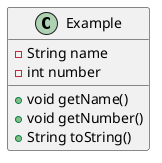
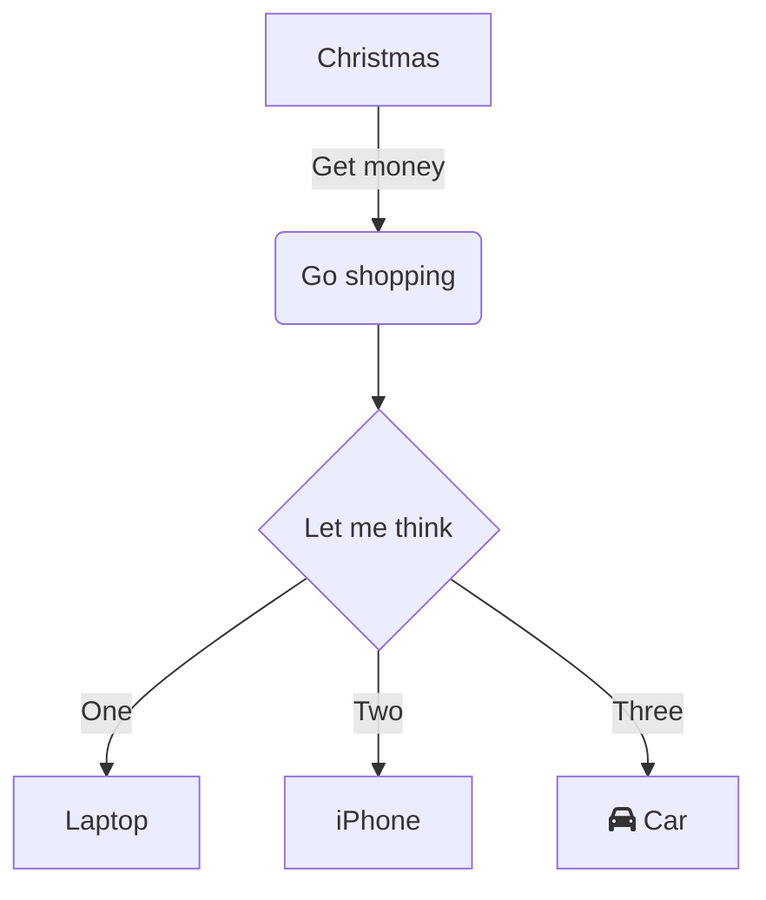

Modelling software is probably the most important part of any software development.

From teams of different sizes, from mono-functional to cross-functional, to inter-team development, software modelling is the most concise way to document the expected behavior of software. Flow charts and standardised notations like UML & BPMN make sure that everyone involved in the development of software, from QA to engineers to management, are all on the same page when in comes to the expected results.

It's important at all stages of the software lifecycle; from making design decisions, to implementation, to verifying implementation, to debugging production. It works as a great sanity check at all levels to make sure what is meant to be done & what is being done makes sense, and to check if what has been done conforms to the design.

It's also a great on-boarding tool for new devs, and makes sure that anyone can poke into the work a team has done without going through massive swathes of code. This makes it great for work that must be shared between teams, but don't necessarily care about the implementation or only need details about certain parts of the code. It effectively acts as more refined API documentation, that not only can explain how to interact with the system with component diagrams, but can also show how the system itself works at a high level.

## UML Tools
The oldest and "easiest" way to make these diagrams has generally been drag-and-drop tools. While not always perfect, they are geat in that anyone can come in and work on or at least interact the diagrams, regardless of background or profession.

### yEd [*](https://www.yworks.com/products/yed)
yEd was the first UML tool I ever used. Many years ago, it was probably one of the worst tools to use, and would have been better to just use Microsoft Paint. While it has slowly improved, I've never been that impressed with it. The main issue is the quality of the diagrams produced always felt sub-par with their bad Auto-layout, and something I could have literally just done in Paint. The lack of collaboration features also made it difficult to work with other people, which is very important for these models.

### StarUML [*](https://staruml.io/)
StarUML was the second modelling tool I used, and it was leaps and bounds better than yEd. However, the main issue holding it back was (and seemingly still is) a lack of proper collaboration features. Just sharing a single file isn't practical, and merging becomes an exponentially larger issue the larger the teams gets.

### Diagrams.net (previously Draw.IO) [*](https://app.diagrams.net/)
This is the tool I've used the most, and the only tool I've used extensively professionally. The [Google Drive integration](https://www.drawio.com/blog/google-shared-drives) makes it by far the best UML tool just for ease of collaboration. While it can be fickle, grouping doesn't always work, and re-arranging elements can be strenuous, it is by far the most adaptable, easy to use, and easiest to collaborate with.

It's worth mentioning [Lucidchart](www.lucidchart.com) and [Visual Paradigm](www.visual-paradigm.com) here, as they are quite similar to Diagrams.net. All three are online-first UML tools build around easy collaboration. Both Lucidchart and Visual Paradigm provide a basic minimum of documentation on what UML is, but Visual Paradigm in particular has very good UML references with it's [comprehensive guides](https://www.visual-paradigm.com/guide/). I haven't used either as there isn't much of a point of leaving your free Google Drive to use these paid subscription services.

### Modelio [*](https://www.modelio.org/index.htm)
Feels like a more professional version of Draw.IO with more advanced features.

### Bonita [*bonitasoft.com]
Bonita provides a wide range of products, from BPMN modeling, to process automation, to form generation. While the ideas are interesting, I have never, ever like their tools. Every, single, thing takes so long to do, even when you know exactly what to do. Pricing can also easily get out of control.

## Modelling Langages

Modelling languages provide a much better experience for developers and engineers. While many diagrams are meant to be legible and worked on by cross-functional people, the fact remains that a lot of UML, i.e. Class and Component diagrams, are mostly targeted to those more technically-savy to describe implementation.

It's interesting to note that Draw.IO actually supports some of these languages, check out these posts: [1](https://www.drawio.com/blog/mermaid-diagrams), [2](https://www.drawio.com/blog/diagrams-from-code)

### Plant UML [*](https://plantuml.com/)

PlantUML is a very good language. It supports the most important segment of UML diagrams including Class, Component, and State, and also supports a few other diagram types like Gantt or drawing diagrams for JSON data.

The syntax doesn't feel standard. The UML syntax feels very clean, while others like Actors seems disconnected, seemingly following a different format.



It, however, requires a running server to render these diagrams.

### D2 [*](https://d2lang.com/)
D2's neat, and it's main allure, for me at least, is that it's much more general purpose. It's for all sorts of diagramming and graphing, not just UML.

The syntax is also very clean, reminiscient of JSON, and styling is very easy, including on individual elements. The on thing I don't like is the fact that the names of identifiers / variables can contain spaces, which is allowed in no language I can think of, making it sometimes awkward to read.

One of it's differentiating factors is that it is the only one of these languages that supports animations, although I don't see the point of that.

It has the same drawback as PlantUML, requiring a server for rendering.

### MermaidJS [*](https://mermaid.js.org/)
Mermaid takes sort of a middle ground between D2 and Plant; it's not as restrictive as PlantUML, but not so general purpose as D2. The syntax is reminiscient of YAML.

For me, the big allure is the amount of [integrations](https://mermaid.js.org/ecosystem/integrations-community.html). This means that you can edit & view your diagrams without having to configure a server. This is especially interesting as diagrams are rendered by many code-hosting platforms such as GitHub (see [this article for more](https://docs.github.com/en/get-started/writing-on-github/working-with-advanced-formatting/creating-diagrams)) and GitLab, meaning people can see your diagrams without needing any additional software, or without requiring one to export the graphs to an image. This also means you can easily include system / software documentation where the systems actually are in your code.

> GitHub supports MermaidJS in MarkDown files, but GitHub Pages doesn't necessarily support Mermaid. When using a static site renderer like Jekyll, pages are build into html, and mermaid syntax will not be rendered. Read [this blog post](https://jackgruber.github.io/2021-05-09-Embed-Mermaid-in-Jekyll-without-plugin/) for info on how to get it working on GitHub Pages.

<script src="https://unpkg.com/mermaid@8.9.3/dist/mermaid.min.js"></script>

<script>
$(document).ready(function () {
  mermaid.initialize({
    startOnLoad:true,
    theme: "default",
  });
  window.mermaid.init(undefined, document.querySelectorAll('.language-mermaid'));
});
</script>

```
flowchart TD
    A[Christmas] -->|Get money| B(Go shopping)
    B --> C{Let me think}
    C -->|One| D[Laptop]
    C -->|Two| E[iPhone]
    C -->|Three| F[fa:fa-car Car]
```


The biggest drawback, however, is the limited types of diagrams. Component diagrams are still experimental, but their results are nothing compared to [PlantUML's component diagrams](https://plantuml.com/component-diagram).

## What to use?

When working with cross-functional teams, it can be important for everyone involved to be able to work on diagrams. In that case it's generally best to use a tool like Diagrams.net.

If the team isn't cross-functional, or your making diagrams at a level that doesn't require the input of cross-functional people, then the best bet is MermaidJS just do to the integrations it has with GitHub and GitLab, allowing anyone that goes to your code to automatically see your models.
